# UART Transmitter and Receiver

A Verilog UART loopback project implemented and simulated in Vivado. The design contains a baud-rate generator, UART transmitter, UART receiver, and a top-level internal loopback connection.

## Project Overview

The top-level module connects the transmitter serial output directly to the receiver serial input:

```text
                 +----------------------+
clk ------------>| baud_rate_generator  |
                 +----------+-----------+
                            | tx_enb / rx_enb
                            v
 data_in[7:0] --> +----------+-----------+       tx_temp       +----------+-----------+ --> data_out[7:0]
 wr_enb --------->|     transmitter     |--------------------->|      reciever      |--> rdy
 rst ------------>|                     |                      |                     |
                  +---------------------+                      +---------------------+
```

This is a data-level internal loopback. The serial TX and RX signals are not exposed as external top-level ports.

## Main Features

- 8-bit UART transmitter
- 8-bit UART receiver
- Start bit, 8 data bits, and stop bit framing
- Internal transmitter-to-receiver loopback
- `busy` status during transmission
- `rdy` status when received data is available
- `rdy_clr` input to clear the receive-ready flag
- Separate transmit and receive enable ticks
- Named module port connections for safer elaboration and maintenance

## Baud-Rate Generation

The baud-rate generator uses two counters:

| Signal | Counter limit | Purpose |
| --- | ---: | --- |
| `tx_enb` | 5208 | Transmit timing tick |
| `rx_enb` | 325 | Receive oversampling tick |

The receive tick is approximately 16 times faster than the transmit tick. With a 100 MHz input clock, these divider values are suitable for approximately 19,200 baud operation.

## Repository Structure

```text
.
|-- baud_rate_generator.xpr
|-- UART.srcs/
|   |-- sources_1/new/
|   |   |-- baud_rate_generator.v
|   |   |-- reciever.v
|   |   |-- transmitter.v
|   |   `-- uart_top.v
|   `-- sim_1/new/
|       `-- uart_top_tb.v
|-- docs/images/
|-- .gitignore
`-- README.md
```

Vivado-generated cache, run, simulation, hardware, IP, and report files are excluded by `.gitignore`.

## Simulation

The testbench performs the following sequence:

1. Starts a 10 ns clock (`#5` half-period).
2. Applies reset.
3. Sends `8'h41` through the transmitter.
4. Waits for the transmitter to become idle and the receiver to assert `rdy`.
5. Checks the received value on `data_out`.
6. Clears `rdy` and repeats the transfer.

The simulation waveforms show:

- `data_in = 8'h41` being accepted for transmission.
- `busy` becoming active while the frame is transmitted.
- The internal serial loopback from TX to RX.
- `data_out = 8'h41` after reception.
- `rdy` asserting when the received byte is valid.

### Top-Level UART Loopback

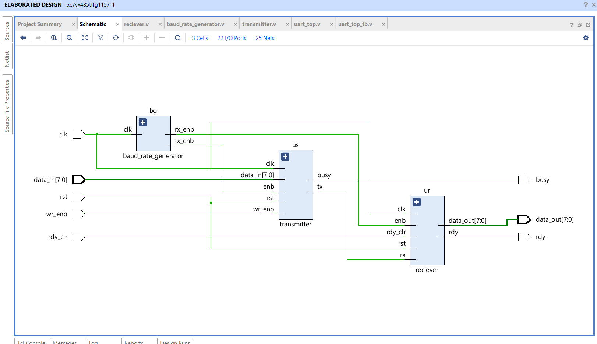

### Elaborated Design

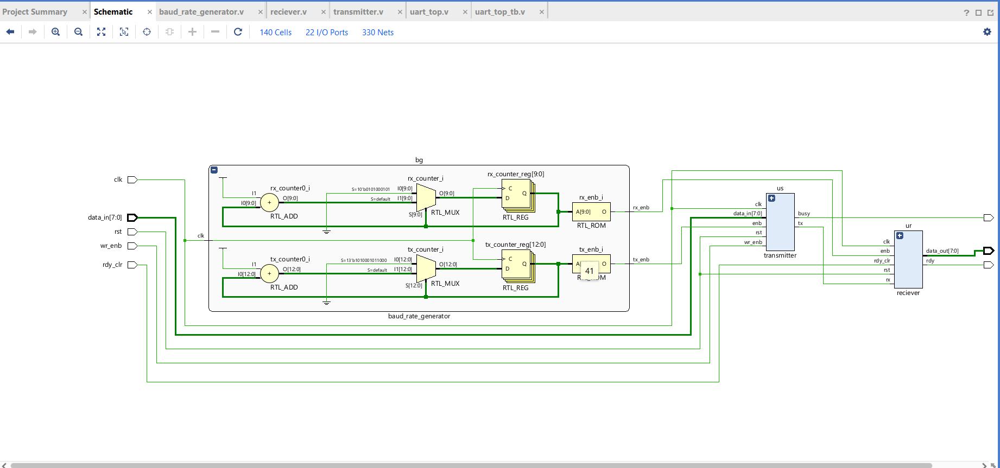

### Elaborated Transmitter

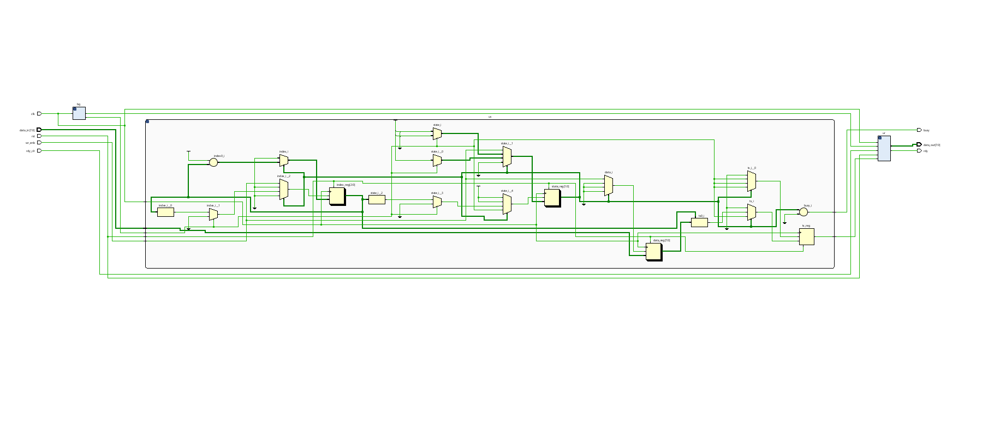

### Elaborated Receiver

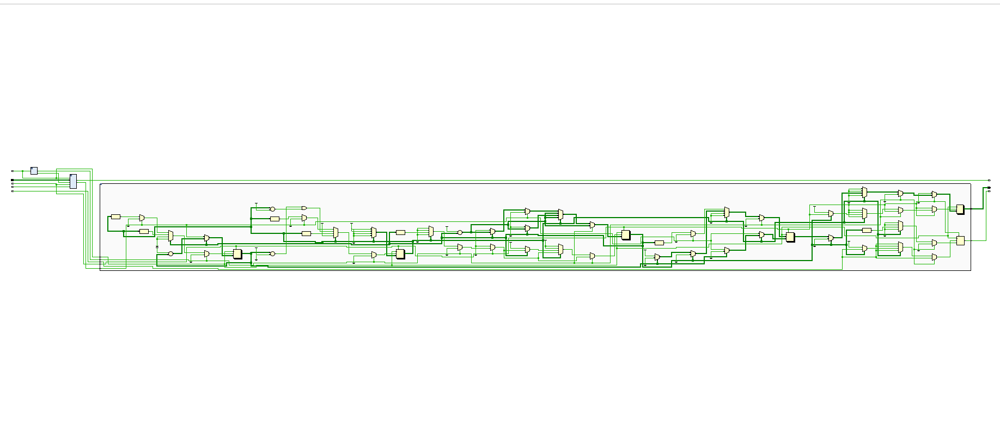

## Simulation Waveforms

The following captures show the clocking, baud-rate counters, transmitter state machine, receiver state machine, loopback transfer, and receive-ready behavior.

### Simulation Hierarchy and Signals

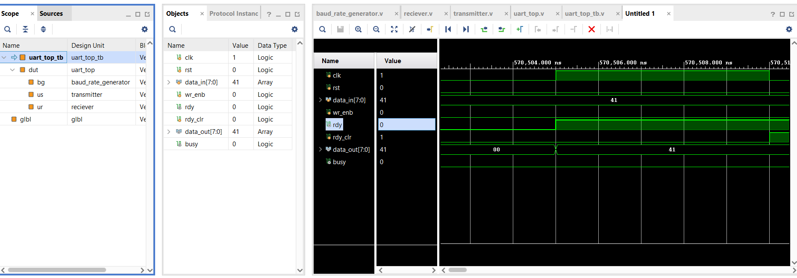

### Baud-Rate Generator Counters

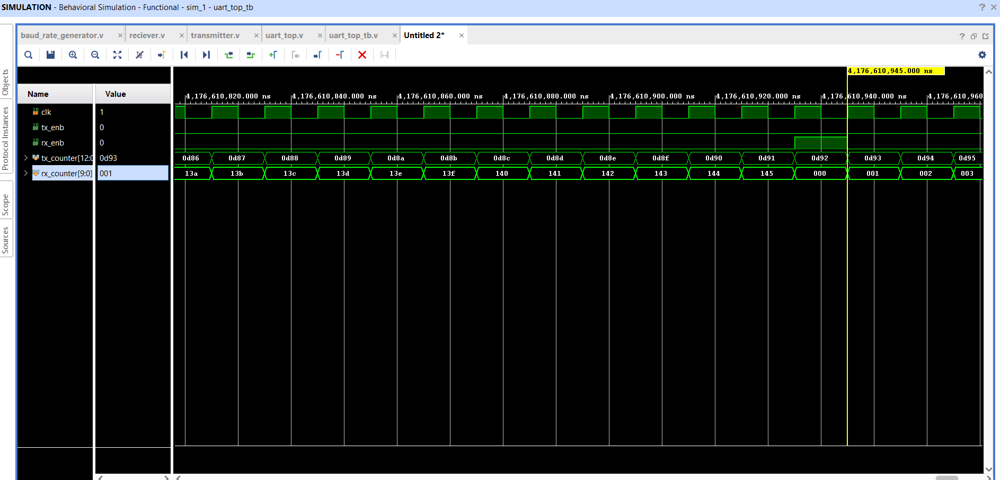

### Transmitter Waveform

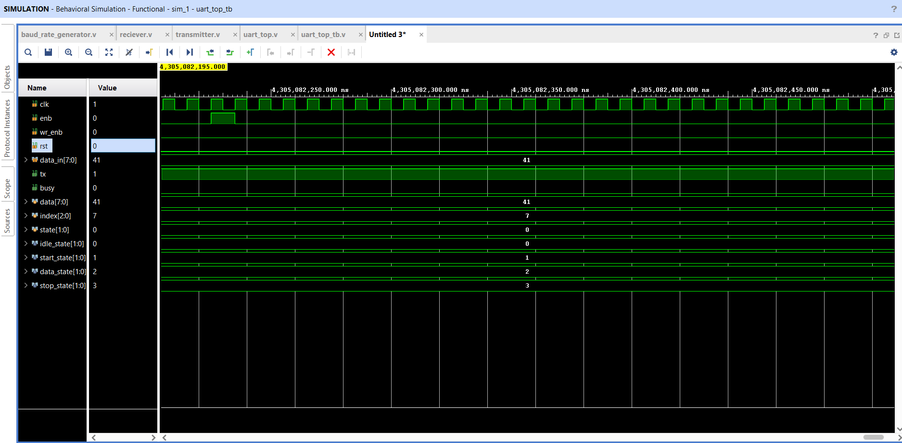

### Receiver Waveform

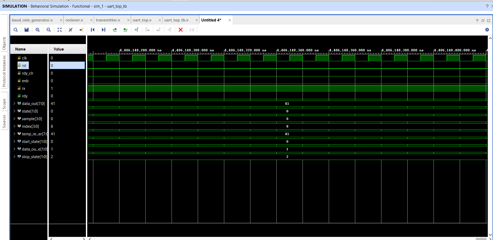

### Initial Transfer

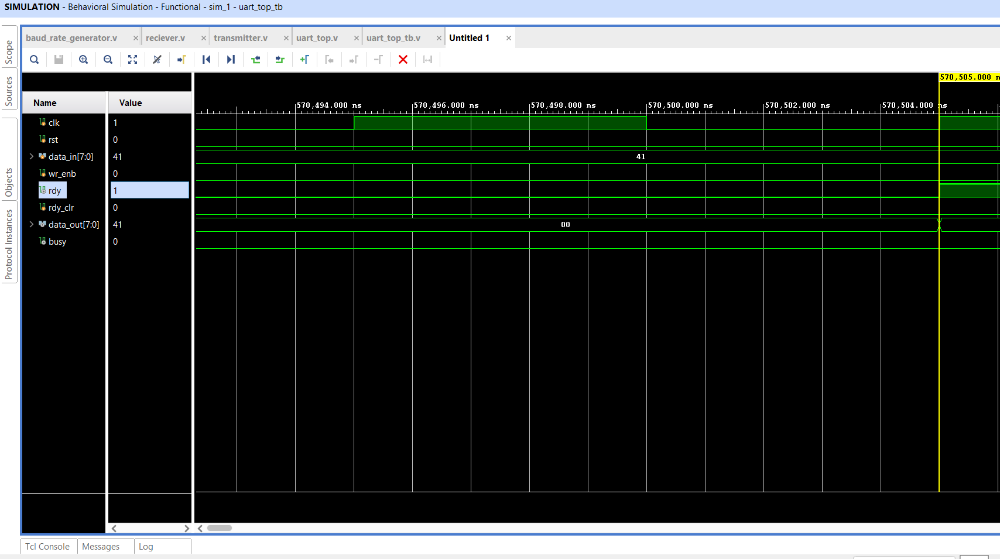

### Received Byte

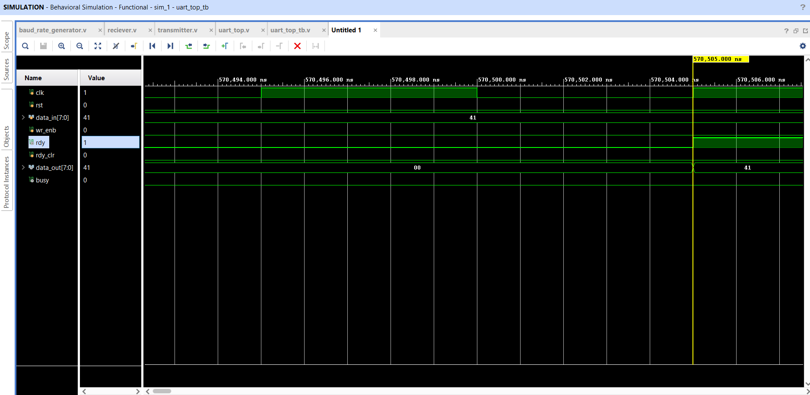

### Ready Clear

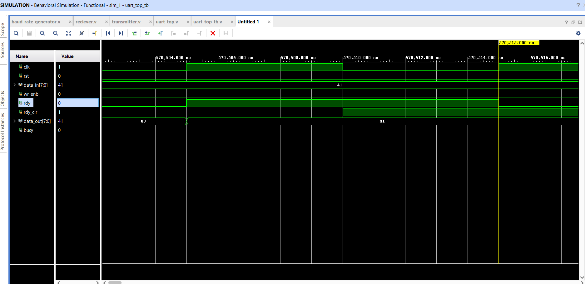

## Top-Level Interface

| Port | Direction | Width | Description |
| --- | --- | ---: | --- |
| `clk` | Input | 1 | System clock |
| `rst` | Input | 1 | Synchronous reset |
| `wr_enb` | Input | 1 | Starts a transmit operation |
| `data_in` | Input | 8 | Byte to transmit |
| `rdy_clr` | Input | 1 | Clears the receive-ready flag |
| `rdy` | Output | 1 | Indicates valid received data |
| `busy` | Output | 1 | Indicates an active transmission |
| `data_out` | Output | 8 | Received byte |

## Opening the Project

1. Open `baud_rate_generator.xpr` in Vivado.
2. Set `uart_top` as the simulation or synthesis top module as required.
3. Select `uart_top_tb` for behavioral simulation.
4. Run behavioral simulation and inspect `data_in`, `busy`, `data_out`, and `rdy`.

## Tools

- Verilog HDL
- AMD Xilinx Vivado
- Vivado XSim behavioral simulation
- Target device shown in the elaborated design: `xc7vx485tffg1157-1`

